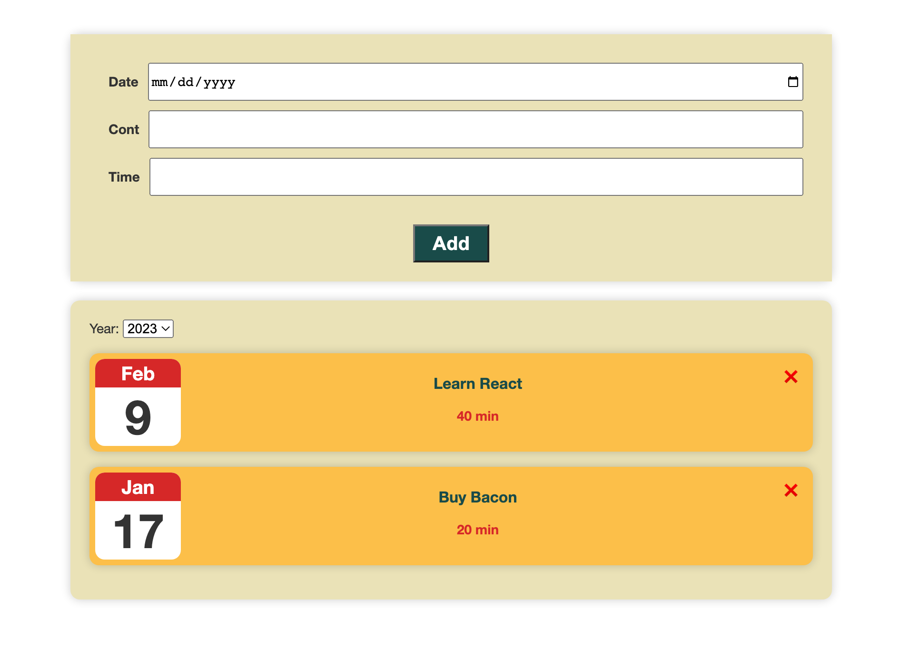
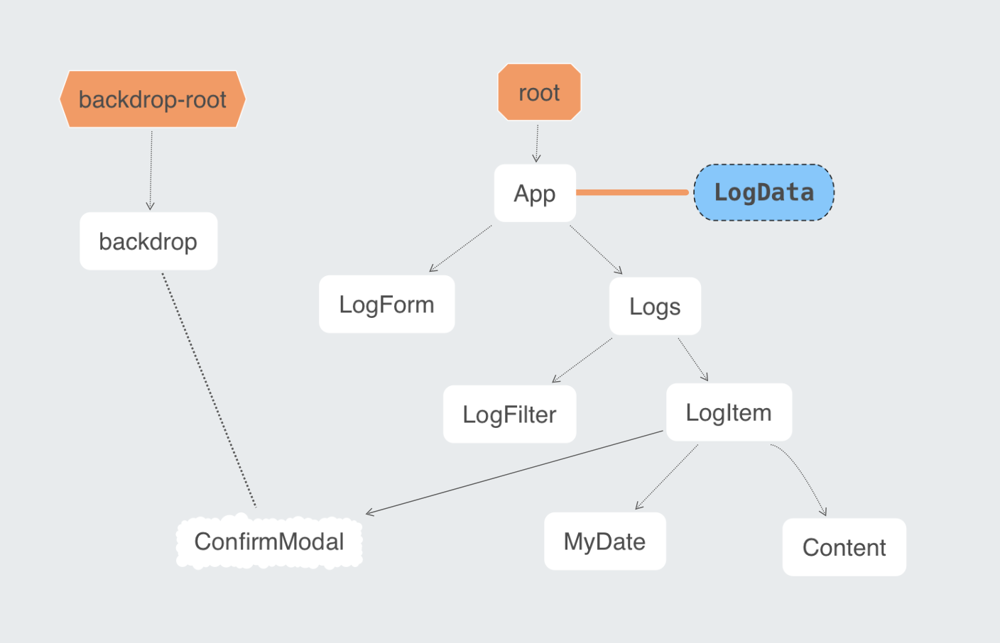

# TodoList Web/App

This project is a TodoList Web/App development project. The first phase is completed. The following functions can be used:

### 1. Add
add a log consisting of date/content/time
### 2. Delete
delete a log.
### 3. Filter 
users can filter logs by year

### Lessons Learned
- I use <strong>CSS Modules</strong> and <strong>Sass</strong> to enhance development efficiency.
- I use over 10 components to do this project for future maintenance, scaling and improving. Its structure is below:

### Next step
- Integrate with MongoDB to test the back-end.
- Use UI framework/libraries (such at ant design) to make forms/buttons/etc. more beautiful.